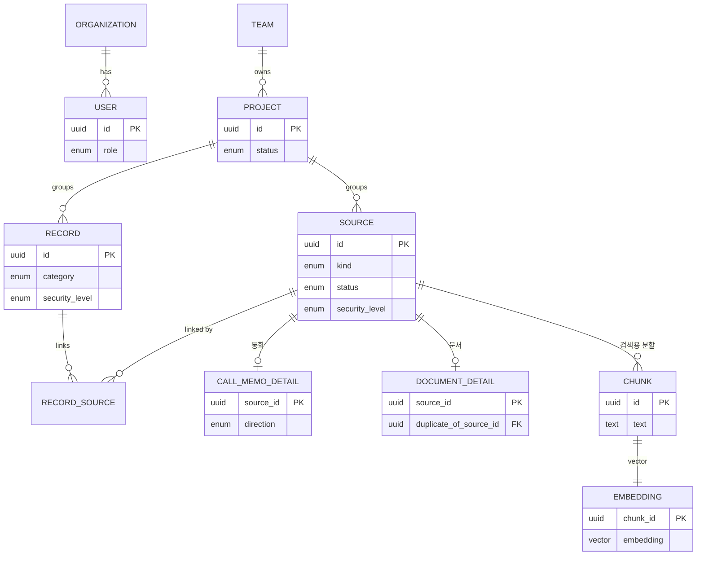

# Contix — 팀 지식·인수인계 관리 도구

> **현재 정부지원사업 과제로 MVP를 개발 중인 프로젝트입니다.** 기획·데이터 설계·백엔드 구현을 진행하고 있습니다.

업무를 하다 보면 통화 메모, 슬랙 대화, 문서가 여기저기 흩어집니다. Contix는 이걸 매일 쓰는 도구 안에서 모아 정리해 두고, **담당자가 바뀌면 그 기록이 그대로 인수인계 자료가 되도록** 만드는 팀용 데스크톱 도구입니다.

인수인계 툴이 대부분 실패하는 이유는 **퇴사할 때만 쓰기 때문에 평소엔 안 열어본다**는 거였습니다. 그래서 Contix는 "문서를 작성하세요"라고 시키지 않고, 통화·메일·파일을 다룰 때 옆에서 "이거 기록해둘까요?"를 대신 해줍니다. 인수인계는 그 부산물로 쌓입니다.

---

## 핵심 담당 업무

- 제품 기획과 UX 정의
- 데이터 모델 설계 (ERD, 스키마)
- 백엔드 구현 (Spring Boot, 도메인 엔티티 · 인증 · 권한 · AI 연동 부분)

---

## 기술 스택

| 구분      | 기술                                                          |
| --------- | ------------------------------------------------------------- |
| Backend   | Java 21, Spring Boot 3.3.5                                     |
| Database  | PostgreSQL 16 (+ pgvector · pg_trgm — 의미검색과 한국어 부분일치를 DB 하나로) |
| Migration | Flyway                                                        |
| Auth      | JWT                                                           |
| AI        | Anthropic Claude API (MVP는 스텁으로 시작)                    |
| Desktop   | React + Tauri (통화메모 전역 단축키 · 플로팅 · 로컬 폴더 감시용) |

---

## 주요 기능

### 통화 메모 (매일 쓰는 핵심)
바탕화면 플로팅 버튼이나 단축키(`Ctrl+Shift+M`)로 팝업을 띄워 통화 내용을 바로 적습니다. 날짜·발신/수신·상대방·연락처·태그(#견적 #클레임 등)를 남기면, 이전 메모에 저장된 상대방이 자동완성됩니다. 저장하면 AI가 "이 메모를 ○○ 프로젝트에 넣을까요?"를 제안합니다.

### 인박스 — 흩어진 대화 모으기
슬랙, 메일, 카카오톡 같은 곳에서 업무 관련 내용을 모아 보여주고, "기록하기" 한 번으로 프로젝트에 연결합니다. 카카오톡은 공식 API가 없어서, 채팅방 내보내기(txt) 파일을 지정 폴더에 저장하면 Contix가 자동으로 읽어들이는 방식으로 풀었습니다.

### 문서 관리 (AI 제안)
파일을 올리면 AI가 저장 위치를 제안하고("이 문서는 ERP > 정산 폴더가 맞아 보입니다"), 비슷한 문서가 있으면 중복을 알려줍니다. 문서마다 별점(★)을 매겨 오래됐거나 담당자가 없는 문서를 눈에 띄게 합니다.

### 보안 볼트
ID/PW, API Key 같은 민감정보를 5단계 등급(전체 / 팀 / 부서 / 팀장 / 본인)으로 나눠 저장합니다. AI가 문서에서 주민번호·비밀번호를 감지하면 SECRET 등급을 제안하고, 누가 언제 열람했는지 로그를 남깁니다.

---

## 데이터 구조

여러 출처(슬랙·메일·통화·문서)를 **하나의 `Source`로 모으고**, 통화·문서처럼 따로 조회할 일이 많은 것만 상세 테이블로 나눴습니다. 사람이 정리한 기록은 `Record`로 두고, 하나의 결정이 여러 출처(슬랙 스레드 + 통화 + 문서)를 묶을 수 있게 연결했습니다.



---

## 설계할 때 신경 쓴 것 두 가지

### 1. 권한은 검색보다 먼저 적용했습니다

검색 결과를 뽑은 다음에 "이건 볼 수 없는 문서네" 하고 걸러내면, 볼 수 있는 문서가 뒤로 밀려 안 보이거나 민감한 내용이 잠깐이라도 노출될 수 있습니다. 특히 AI가 답변을 만들 때 SECRET 문서를 실수로 인용하면 큰 사고입니다.

그래서 **볼 수 있는 문서로 먼저 좁힌 다음** 검색하도록 했고, 권한을 판단하는 코드를 한 곳에 모아 검색과 AI가 똑같은 기준을 쓰게 했습니다.

```java
// 이 사용자가 이 문서를 볼 수 있는가 — 판단을 한 곳에 모음
public boolean canView(User user, ResourceAccessContext r) {
    if (!user.getOrganizationId().equals(r.organizationId())) return false; // 다른 회사 차단
    if (user.getId().equals(r.ownerId())) return true;                      // 본인 문서는 허용
    return switch (r.level()) {
        case PUBLIC     -> true;
        case TEAM       -> user.getTeamId().equals(r.teamId());
        case DEPARTMENT -> user.getDepartmentId().equals(r.departmentId());
        case MANAGER    -> user.getRole() == UserRole.LEAD;
        case SECRET     -> false; // 본인·승인자만
    };
}
```

### 2. AI 연동은 나중에 갈아끼울 수 있게 했습니다

MVP 단계에서 실제 LLM을 바로 붙이면 비용과 불확실성이 커서, 앱은 AI 기능을 인터페이스로만 부르게 하고 처음엔 가짜 응답(스텁)으로 동작시켰습니다. 나중에 Claude 직접 호출로 바꾸거나, OCR·임베딩이 무거워지면 별도 Python 서비스로 빼더라도 **부르는 쪽 코드는 그대로** 두면 됩니다.

---

## 개발 현황

| 영역 | 상태 |
| --- | --- |
| 기획 · UX / 데이터 모델 / ERD | ✅ 확정 |
| 도메인 엔티티 · 초기 스키마 (Flyway) | ✅ 구현 |
| 권한 판단 · AI 연동 부분 | ✅ 구현 |
| 인증(JWT) · REST API | 🚧 진행 중 |
| 통화메모·인박스 화면 / AI 실연동 | 📋 예정 |

---

## 회고

가장 오래 고민한 건 코드가 아니라 **"왜 인수인계 툴은 다 실패했나"** 였습니다. 결론은 "퇴사할 때만 쓰니까 평소에 안 연다"였고, 그래서 매일 쓸 이유(통화 메모)를 먼저 만들고 인수인계는 부산물로 쌓이게 방향을 잡았습니다.

데이터 모델에서 제일 헷갈렸던 건 슬랙·메일·통화·문서를 **테이블을 다 따로 만들지, 하나로 합칠지**였습니다. 처음엔 종류별로 나눴다가, 새 출처(예: Teams)가 생길 때마다 테이블이 늘어나는 게 부담이라 `Source` 하나로 합치고 통화·문서만 상세 테이블로 뺐습니다. 덕분에 나중에 슬랙 말고 메일이나 다른 툴을 붙여도 구조를 바꿀 필요가 없어졌습니다.

아직 MVP라 화면과 AI 실연동은 남아 있지만, 나중에 기능이 늘어나도 흔들리지 않게 데이터 구조와 권한·AI 경계를 먼저 잡아둔 단계입니다.
