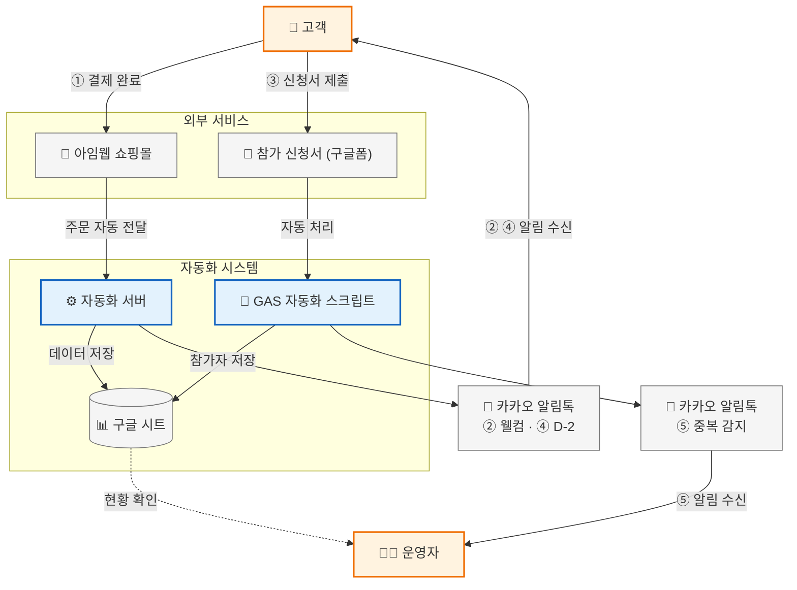
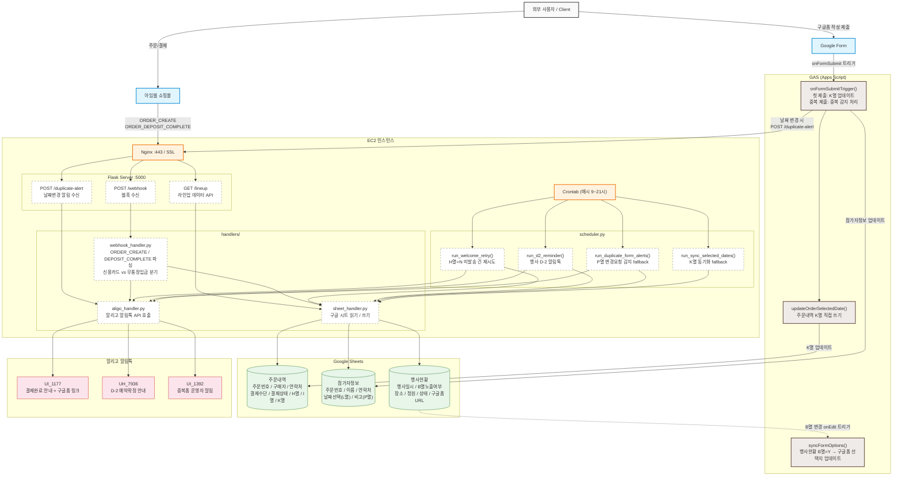
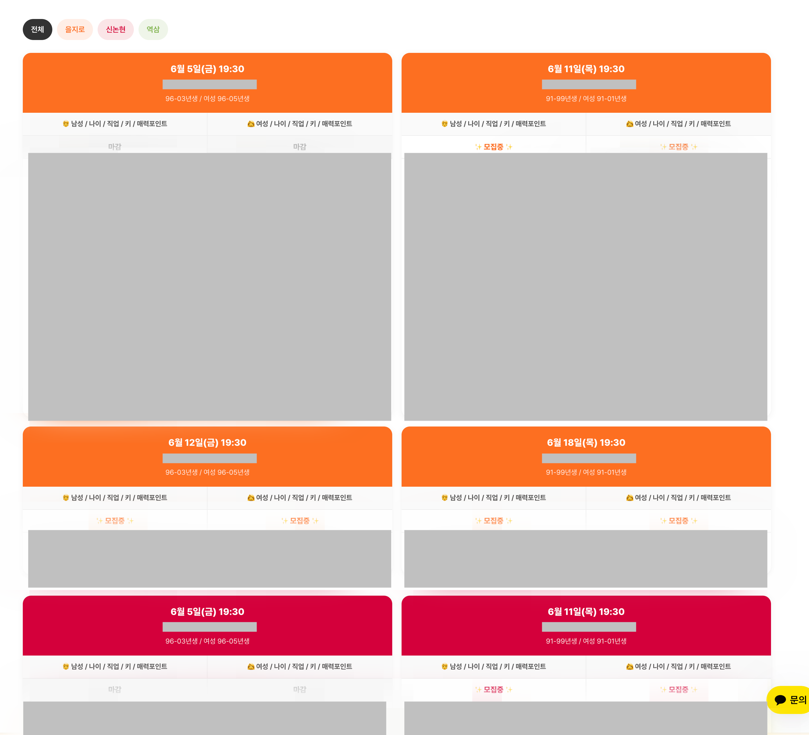
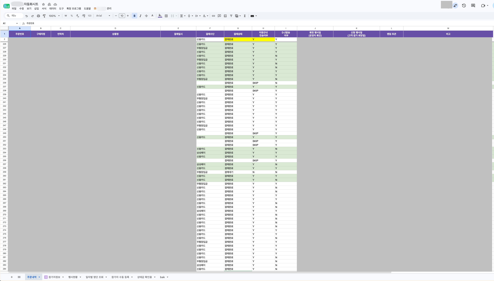
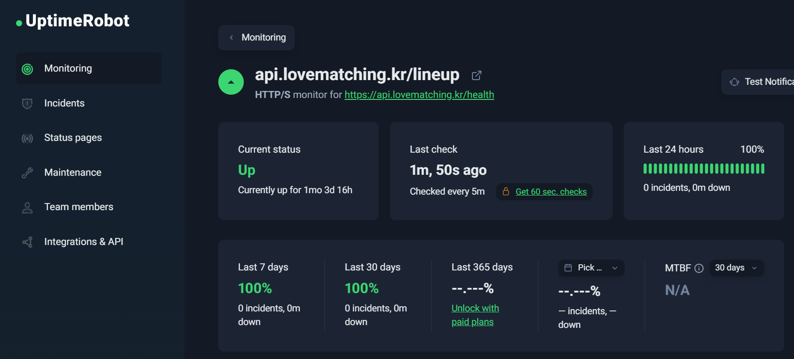

# 아임웹 쇼핑몰 자동화 시스템

아임웹 쇼핑몰 주문 수신부터 알림톡 발송, 구글 시트 연동, 참가자 관리까지 자동화한 백엔드 시스템입니다.

---

## 기술 스택

| 구분 | 기술 |
|------|------|
| Backend | Python 3.9, Flask, Gunicorn |
| Server | AWS EC2 (t4g), Nginx |
| Automation | Google Apps Script (GAS) |
| External API | 아임웹 Webhook, 알리고 알림톡, Google Sheets API |
| Infra | systemd, crontab, Let's Encrypt SSL |

---

## 서비스 흐름



---

## 시스템 아키텍처



---

## 주요 기능

### 1. 주문 자동화 (Webhook)
- 아임웹 주문 발생 시 Webhook 수신
- 신용카드 즉시결제 → 웰컴 알림톡 즉시 발송
- 무통장입금 → 입금 확인 후 자동 발송
- 발송 실패 시 FAIL 기록 → 크론으로 자동 재시도

### 2. 알림톡 자동화
- 결제완료 안내 + 구글폼 링크 발송 (토큰 기반 본인 확인)
- 행사 D-0 / D-1 / D-2 예약확정 알림 자동 발송
- 전화번호 정규화 (010-1234-5678 등 다양한 형식 지원)
- 발송 실패 건 FAIL 기록 및 자동 재시도

### 3. 구글 시트 연동
- 주문 정보 자동 기록
- 구글폼 응답 → 참가자 선택 날짜 자동 동기화
- 중복 폼 제출 감지 → 운영자 알림톡 자동 발송
- 확정행사일 입력 시 참가자정보 자동 업데이트 (GAS onEdit)

### 4. 라인업 페이지 API
- 행사 목록 + 참가자 현황 실시간 제공
- 5분 캐시로 Google Sheets API 호출 최소화
- Thread-safe Lock으로 Cache Stampede 방지
- 지역별 탭 필터 지원

### 5. 일자별 명단 조회
- 행사일 기준 참가자 명단 자동 생성
- 성별 구분, 결제 여부 포함
- GAS 메뉴에서 원클릭 조회

### 6. 참가자 수동 등록
- 운영자 직접 입력 시트 제공
- 주문내역 + 참가자정보 시트 자동 연동

---

## 기술적 의사결정

### 서버 인프라 선택: EC2 vs Lambda

알리고 알림톡 API는 고정 IP 등록이 필수라 서버리스 단독 사용이 불가능했음.

| 방식 | 고정 IP | 비용 |
|------|---------|------|
| Lambda + NAT Gateway | ✅ | ~$35/월 |
| **EC2 + Elastic IP** | **✅** | **~$5/월** |
| Lambda 단독 | ❌ | 알리고 사용 불가 |

→ EC2 + Elastic IP 방식 채택. 비용 **87% 절감**

---

### 구글폼 토큰 기반 본인 확인

폼 제출 시 주문번호를 URL 파라미터로 전달하면 구글 시트에서 주문번호 기반 매칭이 가능하지만, 주문번호가 외부에 노출되는 보안 문제가 있었음.

→ 16자리 랜덤 hex 토큰을 주문 시 생성해 알림톡 링크에 포함. 토큰 기반으로 참가자 매칭하여 주문번호 노출 없이 본인 확인 구현.

---

### Webhook 실패 대응: 이중 안전망 구조

아임웹 Webhook은 실패 시 재시도가 제한적이라 단일 수신 구조로는 발송 누락 가능성이 있었음.

```
1차: Webhook 수신 즉시 발송 시도
2차: 크론(매분) → 미발송(N) / 실패(FAIL) 건 자동 재시도
```

→ 네트워크 오류, 서버 재시작 등 어떤 상황에서도 누락 방지

---

## 운영 모니터링

- **자체 메모리 로거** — 5분 간격으로 RAM/SWAP 상태 기록, SSH 세션 종료 후에도 백그라운드 유지
- **UptimeRobot** — 외부에서 5분 주기로 `/lineup` 헬스체크, 서버 다운 시 즉시 알림

---

## 트러블슈팅 히스토리

| 발생 일자 | 이슈 | 조치 |
|-----------|------|------|
| 2026-06-01 | Flask 디버그 모드 구동 중 OOM으로 서버 다운 | Swap 2GB 추가, Gunicorn 운영 모드 전환 |
| 2026-06-02 | Gunicorn 워커 메모리 누수 위험 | `--max-requests 500` 워커 자동 리프레시, `gc.collect()` 강제 호출 |
| 2026-06-03 | 라인업 페이지 요청마다 시트 API 3개 호출로 메모리 급증 | 5분 캐시 + Thread-safe Lock 적용, 시트 읽기 범위 최적화 |
| 2026-06-05 | 워커당 109MB → 390MB 지속 증가 | Google Sheets API 클라이언트 싱글톤 캐싱, 420MB 안정화 |

---

## 트러블슈팅

### 메모리 누수 해결
**문제:** EC2 t4g.micro (1GB RAM) 에서 1~2시간마다 메모리가 800MB 이상으로 치솟아 서버 불안정

**원인 분석:**
```
재시작 직후  → 워커당 109MB
1~2시간 후   → 워커당 390MB (+281MB 누수)
```

Google Sheets API 클라이언트(`build()`)를 매 요청마다 새로 생성하면서 메모리 누적

**해결:**
```python
# Before: 매 요청마다 새 객체 생성
def _get_service():
    return build("sheets", "v4", credentials=creds, cache_discovery=False)

# After: 워커당 최초 1회만 생성 후 재사용 (싱글톤)
_service_cache = None

def _get_service():
    global _service_cache
    if _service_cache is not None:
        return _service_cache
    _service_cache = build("sheets", "v4", credentials=creds, cache_discovery=False)
    return _service_cache
```

**결과:**
| | 개선 전 | 개선 후 |
|--|---------|---------|
| 워커 메모리 (재시작 직후) | 109MB | 41MB |
| 장기 운영 시 메모리 | 800MB+ (불안정) | 420MB (안정) |
| SWAP 사용량 | 382MB (지속 증가) | 48MB (고정) |

---

### 전화번호 형식 불일치
**문제:** 구글 시트가 전화번호를 숫자로 인식해 앞자리 `0` 제거 (01012345678 → 1012345678)

**해결:** 발송 전 숫자만 추출 후 11자리 검증
```python
# utils/validators.py
def normalize_phone(phone: str) -> str:
    digits = "".join(filter(str.isdigit, str(phone)))
    if digits.startswith("82"):
        digits = "0" + digits[2:]
    return digits

def is_valid_phone(phone: str) -> bool:
    return len(normalize_phone(phone)) == 11
```

---

## 스크린샷

### 라인업 페이지


### 주문내역 구글 시트


### UptimeRobot 모니터링


---

## 성과

- 주문 발생부터 알림톡 발송까지 **완전 자동화**
- 발송 실패 건 자동 재시도로 **누락 0건** 목표
- 서버 메모리 **800MB → 420MB** 안정화
- Google Sheets API 호출 **5분 캐시**로 최소화
- 운영자 수동 작업 **90% 이상 감소**
